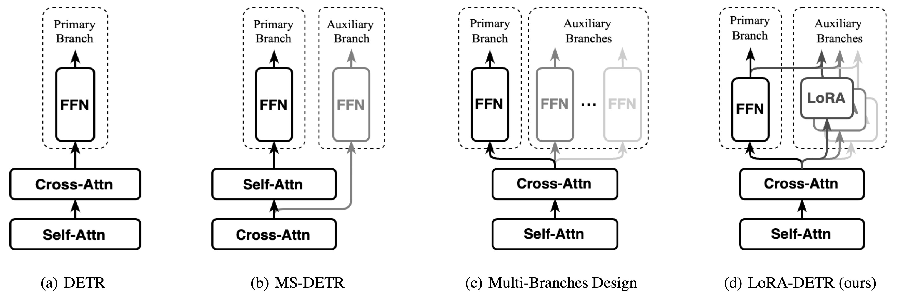

# LoRA-DETR [AAAI 2026]

[AAAI2026] [Integrating Diverse Assignment Strategies into DETRs](https://arxiv.org/abs/2601.09247) official implement.



## News

- **2025.11**: LoRA-DETR accepted at AAAI 2026.
- **2026.01**: Paper and code is released.

## Abstract

Label assignment is a critical component in object detectors, particularly within DETR-style frameworks where the one-to-one matching strategy, despite its end-to-end elegance, suffers from slow convergence due to sparse supervision. While recent works have explored one-to-many assignments to enrich supervisory signals, they often introduce complex, architecture-specific modifications and typically focus on a single auxiliary strategy, lacking a unified and scalable design. In this paper, we first systematically investigate the effects of \`\`one-to-many'' supervision and reveal a surprising insight that \textit{performance gains are driven not by the sheer quantity of supervision, but by the diversity of the assignment strategies employed.} This finding suggests that a more elegant, parameter-efficient approach is attainable. Building on this insight, we propose LoRA-DETR, a flexible and lightweight framework that seamlessly integrates diverse assignment strategies into any DETR-style detector. Our method augments the primary network with multiple Low-Rank Adaptation (LoRA) branches during training, each instantiating a different one-to-many assignment rule. These branches act as auxiliary modules that inject rich, varied supervisory gradients into the main model and are discarded during inference, thus incurring no additional computational cost. This design promotes robust joint optimization while maintaining the architectural simplicity of the original detector. Extensive experiments on different baselines validate the effectiveness of our approach.
Our work presents a new paradigm for enhancing detectors, demonstrating that diverse \`\`one-to-many'' supervision can be integrated to achieve state-of-the-art results without compromising model elegance.

## Data

Using the [COCO-2017](https://cocodataset.org/) dataset for training/evaluation. Organize the dataset as follows:

```shell
coco_path/
  ├── train2017/
  ├── val2017/
  └── annotations/
  	├── instances_train2017.json
  	└── instances_val2017.json
```

## Quick Start

### Deformable DETR (follow [MS-DETR](https://github.com/Atten4Vis/MS-DETR))

We tested our code with `Python=3.10, PyTorch=1.12.1, CUDA=11.3`. Please install PyTorch first according to [official instructions](https://pytorch.org/get-started/previous-versions/).

```shell
git clone https://github.com/Z1zyw/LoRA-DETR.git
cd LoRA-DETR
pip install -r requirements.txt
```

Then, compile MSDeformAttn CUDA operators.

```sh
cd models/ops
python setup.py build install
```

#### Naive-multi-branches

```shell
./scripts/naive_def_300.sh
```

Modify **num_aux** to reproduce the results in Table 1 and Figure 3(a)

#### LoRA-detr

To reproduce the paper results in Table 2:

```shell
./scripts/lora1_def_300.sh
```

```shell
./scripts/lora3_def_300.sh
```

```shell
./scripts/lora1_def_pp_900.sh
```

```shell
./scripts/lora3_def_pp_900.sh
```

### Relation-DETR

```shell
cd relation-detr
```

For [Relation-DETR](https://github.com/xiuqhou/Relation-DETR) as baseline, please folow the official [repositor](https://github.com/xiuqhou/Relation-DETR) to prepare environment.

Then, modify **model_path** in relation-detr/config/train_config.py and **CUDA_PATH** in train.sh to reproduce the paper results in Tables 2 and 3.

#### Training

```shell
./train.sh
```

## Acknowledgements

It is greatly inspired by the following outstanding contributions to the open-source community: [MS-DETR](https://github.com/Atten4Vis/MS-DETR), [Relation-DETR](https://github.com/xiuqhou/Relation-DETR)

## Citation

If LoRA-DETR supports or enhances your research, please acknowledge our work by citing our paper and give our rep a star 🌟. Thank you!

```bibtex
@article{zhang2026integrating,
  title={Integrating Diverse Assignment Strategies into DETRs},
  author={Zhang, Yiwei and Gao, Jin and Wang, Hanshi and Ge, Fudong and Luo, Guan and Hu, Weiming and Zhang, Zhipeng},
  journal={arXiv preprint arXiv:2601.09247},
  year={2026}
}
```